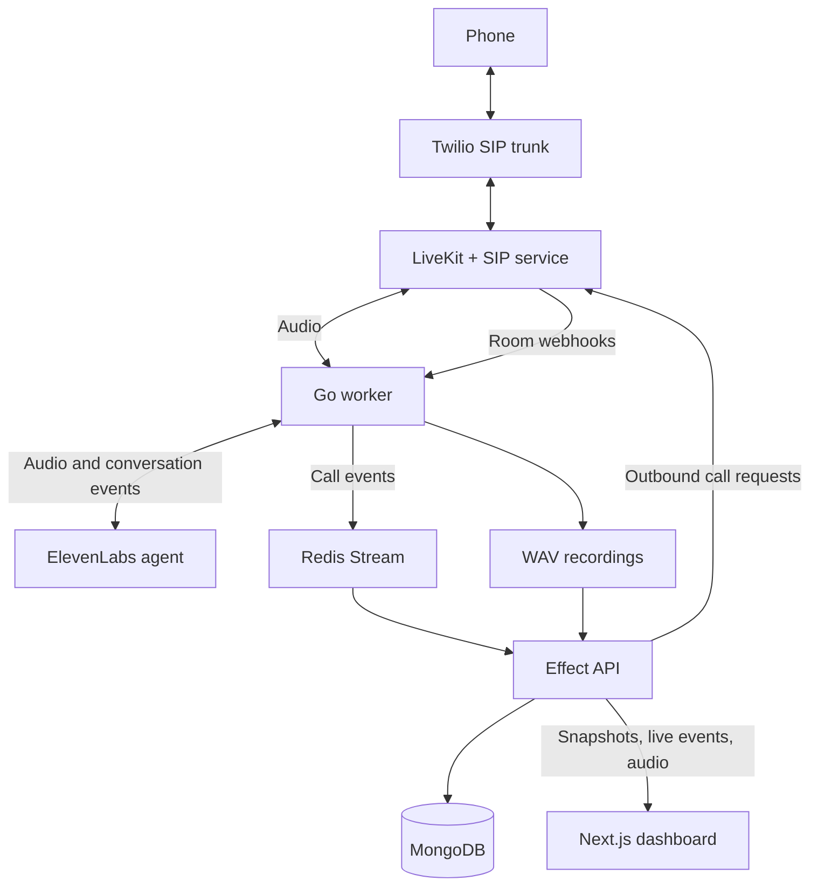

# Ringback

**AI phone calls on your own infrastructure. Bring your own carrier.**

Ringback gives your AI agent a phone line. Connect an ElevenLabs voice agent to a SIP trunk, and it can answer calls, dial out with a task-specific prompt, and press keypad digits to navigate phone menus. Watch the conversation unfold in a live dashboard, then read the transcript or play back the recording.

## Why Ringback?

- **Host the calling stack yourself.** Docker Compose runs LiveKit, the LiveKit SIP service, Redis, MongoDB, the Go worker, the API, and the dashboard on your own Linux host. The media server, event stream, and database are part of the deployment.
- **Bring your own carrier (BYOC).** Native SIP connects your carrier's phone network to LiveKit rooms. The included trunk configuration uses Twilio; adapt the SIP settings for your provider and numbers.
- **Keep application storage on your infrastructure.** Call history and transcripts live in your MongoDB instance. WAV recordings live in a volume shared by the worker and API, ready for playback from the dashboard.
- **Put an agent to work with one API request.** Send a destination and a prompt to `POST /calls`. Ringback dials the number, waits for an answer, starts the agent conversation, and streams its progress to the dashboard.

ElevenLabs provides the hosted voice agent. Ringback runs the calling infrastructure, call orchestration, dashboard, and application storage on your host.

## Features

- **Inbound and outbound calls.** Answer calls through a SIP trunk or start a call with `POST /calls`.
- **Prompts per call.** Outbound requests set the agent's prompt; inbound calls use the agent's configured prompt.
- **Phone menu navigation.** The agent can press keypad digits through the `send_dtmf` client tool.
- **Live transcripts.** Follow caller, agent, and tool turns as they arrive, including transcript corrections.
- **Call history and playback.** Store call metadata and transcripts in MongoDB, with optional stereo WAV recordings.

## How it works



The worker starts a session when LiveKit creates a room whose name begins with `call`. Once the phone participant answers, it bridges the room's audio to an ElevenLabs conversation. Call events flow through the `ringback:calls` Redis Stream to the API, which saves them in MongoDB and sends updates to the dashboard using server-sent events (SSE).

### Repository layout

| Path                         | Purpose                                                                                  |
| ---------------------------- | ---------------------------------------------------------------------------------------- |
| [`apps/worker`](apps/worker) | Go worker: call sessions, audio, agent tools, recordings, and LiveKit webhooks           |
| [`apps/api`](apps/api)       | TypeScript API built with Effect: call placement, history, transcripts, audio, and SSE   |
| [`apps/web`](apps/web)       | Next.js 16 / React 19 dashboard with SWR and Tailwind CSS                                |
| [`packages`](packages)       | Shared ESLint and TypeScript configuration                                               |
| [`deploy`](deploy)           | LiveKit and SIP configuration, deployment script, Caddy configuration, and host services |

## Local development

### Prerequisites

- Node.js 22, matching the API CI job and application Docker images.
- pnpm 9, pinned to `9.0.0` in `package.json`.
- Docker with Docker Compose for Redis and MongoDB.
- For the voice worker: Go 1.26, a C compiler, `pkg-config`, and the Opus / Opusfile development libraries.
- For real calls: a reachable LiveKit server and SIP service, a configured SIP provider, and an ElevenLabs API key and agent.

Install the worker's native dependencies:

```sh
# macOS (with Xcode Command Line Tools installed)
brew install pkg-config opus opusfile

# Ubuntu / Debian
sudo apt-get update
sudo apt-get install -y build-essential pkg-config libopus-dev libopusfile-dev
```

### 1. Install dependencies

From the repository root:

```sh
pnpm install --frozen-lockfile
```

### 2. Configure the environment

Create a `.env` file in the repository root. Compose reads it directly; the commands below also load it into the API and worker processes.

```dotenv
LIVEKIT_URL=ws://127.0.0.1:7880
LIVEKIT_API_KEY=replace-with-your-livekit-key
LIVEKIT_API_SECRET=replace-with-your-livekit-secret

ELEVENLABS_API_KEY=replace-with-your-elevenlabs-key
ELEVENLABS_AGENT_ID=replace-with-your-agent-id

REDIS_URL=redis://127.0.0.1:6379
MONGODB_URI=mongodb://127.0.0.1:27017/ringback
CORS_ORIGINS=http://localhost:3000

# Add this to enable outbound call placement:
# RINGBACK_API_KEY=replace-with-a-generated-secret

# Optional: an existing absolute directory shared by the API and worker.
# AUDIO_DIR=/absolute/path/to/recordings
```

Generate a call-placement secret with `openssl rand -hex 32`. The service-specific examples in [`apps/api/.env.example`](apps/api/.env.example) and [`apps/worker/.env.example`](apps/worker/.env.example) are also available as references.

The API and dashboard can run before you configure real LiveKit or ElevenLabs credentials. The dashboard will be empty until the worker publishes call events.

### 3. Start Redis and MongoDB

```sh
docker compose up -d redis mongo
```

This starts the two data services using the checked-in Compose file. The remaining Compose services are described under [Deployment](#deployment).

### 4. Start the API and dashboard

Run each command block in a separate terminal, starting from the repository root.

**API** — the LiveKit API client uses the HTTP endpoint:

```sh
(
  set -a
  . ./.env
  set +a
  LIVEKIT_URL=http://127.0.0.1:7880 pnpm --filter api dev
)
```

**Dashboard:**

```sh
pnpm --filter web dev
```

Open [localhost:3000](http://localhost:3000). The dashboard defaults to the API at `http://localhost:3001`. To change that address, set `NEXT_PUBLIC_API_URL` in `apps/web/.env.local`.

```sh
curl http://localhost:3001/health
curl http://localhost:3001/calls
```

### 5. Connect the voice worker

Before starting the worker, configure the services it connects to:

1. **LiveKit:** use matching API credentials and send room webhooks to the worker's `POST /livekit` endpoint. Locally, that is `http://127.0.0.1:8080/livekit`; a remote LiveKit server needs an address it can reach. Set `webhook.api_key` in [`deploy/config/livekit.yaml`](deploy/config/livekit.yaml) to your LiveKit key.
2. **SIP:** configure your provider and LiveKit trunks. The files in [`deploy/sip`](deploy/sip) contain the current Twilio setup; replace the phone numbers and trunk address for your environment. Keep the outbound trunk name `twilio-outbound`, which the API looks up by name. Inbound dispatch must create rooms beginning with `call`.
3. **ElevenLabs:** configure the agent's input and output audio as `pcm_48000`. The worker checks both formats when connecting. Allow prompt overrides for outbound calls. For keypad navigation, configure a client tool named `send_dtmf` with a required string parameter named `digits` and a tool response.

With valid credentials and a reachable LiveKit WebSocket URL in `.env`, start the worker in another terminal:

```sh
(
  set -a
  . ./.env
  set +a
  cd apps/worker
  go run .
)
```

```sh
curl http://127.0.0.1:8080/healthz
```

The worker listens on `127.0.0.1:8080` by default. Set `WORKER_HTTP_ADDR` if it needs to listen on another interface. For a remote LiveKit server, also update the HTTP URL in the API startup command.

### Configuration reference

| Variable                                    | Used by     | Default / behavior                                                                   |
| ------------------------------------------- | ----------- | ------------------------------------------------------------------------------------ |
| `LIVEKIT_URL`                               | Worker, API | Required WebSocket URL for the worker; API defaults to `http://127.0.0.1:7880`       |
| `LIVEKIT_API_KEY`, `LIVEKIT_API_SECRET`     | Worker, API | Required for worker sessions and outbound dialing                                    |
| `ELEVENLABS_API_KEY`, `ELEVENLABS_AGENT_ID` | Worker      | Required                                                                             |
| `REDIS_URL`                                 | Worker, API | API defaults to `redis://127.0.0.1:6379`; worker publishes no events when unset      |
| `MONGODB_URI`                               | API         | `mongodb://127.0.0.1:27017/ringback`                                                 |
| `RINGBACK_API_KEY`                          | API         | Shared bearer token for `POST /calls`; omitting it disables call placement           |
| `AUDIO_DIR`                                 | Worker, API | Unset disables recording and audio serving; both services must access the same files |
| `WORKER_HTTP_ADDR`                          | Worker      | `127.0.0.1:8080`                                                                     |
| `PORT`                                      | API         | `3001`                                                                               |
| `CORS_ORIGINS`                              | API         | `http://localhost:3000`; accepts comma-separated origins                             |
| `NEXT_PUBLIC_API_URL`                       | Dashboard   | `http://localhost:3001`; embedded in the browser bundle at build time                |

## Using the API

The local API base URL is `http://localhost:3001`. The checked-in Caddy configuration exposes these routes under `/api` in deployment.

| Method | Route                | Description                                                                 |
| ------ | -------------------- | --------------------------------------------------------------------------- |
| `GET`  | `/health`            | API health response                                                         |
| `GET`  | `/calls`             | Up to 100 calls, newest first                                               |
| `GET`  | `/calls/events`      | SSE feed of `call.started`, `call.turn`, and `call.ended` events            |
| `GET`  | `/calls/:room/turns` | Transcript ordered by turn sequence                                         |
| `GET`  | `/calls/:room/audio` | WAV recording, with byte-range support for playback                         |
| `POST` | `/calls`             | Start an outbound call; requires `Authorization: Bearer <RINGBACK_API_KEY>` |

### Place a call

After configuring the outbound trunk, worker, and `RINGBACK_API_KEY`, run this from the repository root. Replace the example number with the intended recipient's number.

```sh
set -a
. ./.env
set +a

curl -X POST http://localhost:3001/calls \
  -H "Authorization: Bearer $RINGBACK_API_KEY" \
  -H 'Content-Type: application/json' \
  -d '{
    "to": "+15551234567",
    "prompt": "You are calling to confirm the appointment time. Keep the conversation brief."
  }'
```

The destination must use E.164 format. The prompt must contain 1–16,000 characters after trimming. A successful request returns `201` with a room identifier:

```json
{ "room": "call_+15551234567_a1b2c3d4e5f6" }
```

This confirms the call was initiated. The call appears in the dashboard once the participant answers and the agent conversation starts. The dashboard currently provides call inspection and playback; outbound calls are initiated through the API.

### Follow live events

```sh
curl -N http://localhost:3001/calls/events
```

The feed supports `Last-Event-ID` to replay missed events still retained in Redis. Timestamps use Unix milliseconds. Transcript roles are `user`, `agent`, and `tool`; a repeated `(room, seq)` updates an existing turn.

Only call placement requires the Ringback bearer token. Call history, transcripts, recordings, and the event feed currently have no application-level authentication; protect access at the network or reverse-proxy layer when deploying.

## Development commands

Run these from the repository root:

```sh
pnpm build                    # Build the API and dashboard
pnpm lint                     # Lint the TypeScript apps and shared packages
pnpm --filter api check-types
pnpm --filter web typecheck
pnpm test                     # Run the API's Vitest suite
```

Run worker checks separately:

```sh
cd apps/worker
go vet ./...
go test -race ./...
go build ./...
```

`pnpm dev` starts the API and dashboard through Turborepo. The Go worker is managed separately. For custom API environment values, use the explicit environment-loading command above. The root `pnpm check-types` command runs the API check; the web package uses a separate `typecheck` script.

## Deployment

The calling stack runs on your own Linux host. [`docker-compose.yml`](docker-compose.yml) includes the LiveKit media server and SIP service alongside Redis, MongoDB, the worker, the API, and the dashboard. You supply the host, SIP carrier configuration, and ElevenLabs credentials.

Compose pulls application images from `ghcr.io/ayukumar261` and uses host networking for LiveKit, SIP, and the worker. Redis, MongoDB, and call recordings use persistent Docker volumes.

The current deployment flow is:

1. [GitHub Actions](.github/workflows/deploy.yml) builds and pushes all three application images on pushes to `main`, then sends a signed request to the deployment webhook.
2. [`deploy/deploy.sh`](deploy/deploy.sh) runs from `/opt/ringback`, resets that checkout to `origin/main`, pulls images, and starts the Compose services.
3. The script creates or updates LiveKit SIP trunks and the dispatch rule, applies the SIP firewall rules, and reloads Caddy.

To adapt this deployment, configure the root `.env`, image names, domain in [`deploy/host/Caddyfile`](deploy/host/Caddyfile), LiveKit webhook key, and SIP settings. The host scripts expect Docker Compose, the `lk` CLI, `jq`, `iptables`, Caddy, and systemd; the deployment hook service also uses the `webhook` binary. GitHub Actions expects `RINGBACK_HOOK_URL` and `RINGBACK_HOOK_SECRET`, with the same hook secret installed on the host as described in [`deploy/host/hook.env.example`](deploy/host/hook.env.example).

The deployed dashboard is built with `NEXT_PUBLIC_API_URL=/api`. Changing that value requires rebuilding the web image. Compose shares an `audio-data` volume between the worker and API and stores Redis and MongoDB data in named volumes.

## Troubleshooting

| Symptom                                     | Check                                                                                                                       |
| ------------------------------------------- | --------------------------------------------------------------------------------------------------------------------------- |
| Dashboard shows no calls                    | Confirm the worker has `REDIS_URL`, the API uses the same Redis instance, and a call has reached an agent conversation.     |
| Worker exits with a missing-variable error  | Load `.env` into the process environment; the worker does not load it automatically.                                        |
| Call placement returns `401` or `503`       | Check the bearer token, whether `RINGBACK_API_KEY` is set, and whether the `twilio-outbound` trunk exists.                  |
| ElevenLabs reports an audio format mismatch | Set both agent audio formats to `pcm_48000`.                                                                                |
| Recordings are unavailable                  | Set `AUDIO_DIR` for both services, ensure the worker can write there and the API can read it, and wait for the call to end. |
| Browser cannot reach the API                | Check `NEXT_PUBLIC_API_URL` and `CORS_ORIGINS`; rebuild the dashboard after changing its production API URL.                |
